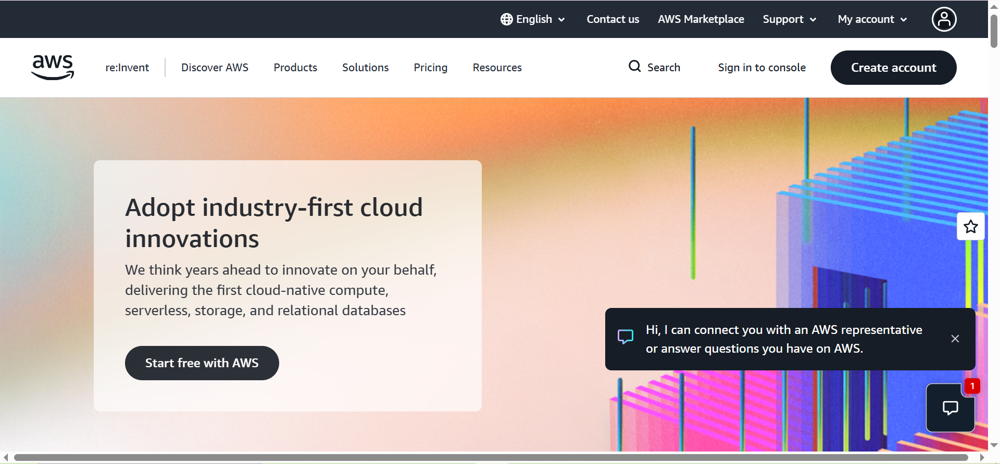

# Amazon Web Services (AWS) Research Report

## Brief Overview
Amazon Web Services (AWS) is the world’s most comprehensive and broadly adopted cloud platform, offering over 200 fully featured services from data centers globally[cite: 1]. It provides on-demand cloud computing platforms and APIs to individuals, companies, and governments on a metered pay-as-you-go basis.

## Global Infrastructure
AWS global infrastructure is built around **Regions** and **Availability Zones (AZs)**[cite: 1]. 
* **Regions:** Independent geographic areas containing multiple physical data centers.
* **Availability Zones:** Discrete data centers with redundant power, networking, and connectivity within a region, allowing customers to run production applications and databases that are more highly available, fault-tolerant, and scalable than would be possible from a single data center.

## Cloud Management Console
The **AWS Management Console** is a web-based interface that encompasses and references a broad collection of service consoles for managing AWS resources. It provides a centralized dashboard to monitor resource utilization, manage billing, configure security settings, and deploy scalable applications[cite: 1].

## Four (4) Core Services
1. **Amazon Elastic Compute Cloud (EC2):** Provides secure, resizable compute capacity in the cloud as virtual servers[cite: 1].
2. **Amazon Simple Storage Service (S3):** Object storage service offering industry-leading scalability, data availability, security, and performance[cite: 1].
3. **Amazon Relational Database Service (RDS):** Makes it easy to set up, operate, and scale a relational database in the cloud[cite: 1].
4. **Amazon Virtual Private Cloud (VPC):** Lets you provision a logically isolated section of the AWS cloud where you can launch AWS resources in a virtual network that you define[cite: 1].

## Three (3) Advantages
* **Deepest Functionality:** Offers the largest variety of services and features for emerging technologies like machine learning, IoT, and data analytics[cite: 1].
* **Massive Global Ecosystem:** Backed by an extensive network of global partners, developers, and third-party integrations[cite: 1].
* **Security and Compliance:** Built to meet the requirements of the most security-sensitive organizations, featuring numerous global compliance certifications[cite: 1].

## Typical Enterprise Use Cases
* Highly scalable web applications and SaaS platforms[cite: 1].
* Big data analytics and data warehousing[cite: 1].
* Enterprise resource planning (ERP) and disaster recovery solutions[cite: 1].

---
*Screenshot Evidence:*

