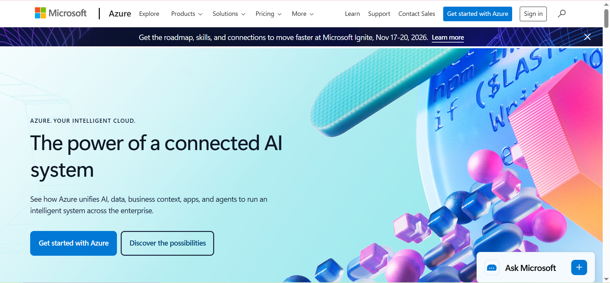

# Microsoft Azure Research Report

## Brief Overview
Microsoft Azure is a constantly expanding set of cloud services designed to help your organization meet your business challenges. It is a public cloud computing platform characterized by strong hybrid capabilities and seamless integration with existing Microsoft enterprise environments.

## Global Infrastructure
Azure has more global regions than any other cloud provider, backed by a massive physical network comprising millions of miles of fiber-optic cables, edge sites, and subsea cables. This infrastructure delivers world-class resilience, low latency, and high availability worldwide.

## Cloud Management Console
The **Azure Portal** is a web-based, unified console that allows you to build, manage, and monitor everything from simple web apps to complex cloud deployments. It provides a customizable dashboard for resource provisioning, role-based access control (RBAC), and service health tracking.

## Four (4) Core Services
1. **Azure Virtual Machines:** Provision Windows and Linux virtual machines in seconds.
2. **Azure Blob Storage:** Massively scalable object storage for unstructured data, optimized for massive data storage loads.
3. **Azure SQL Database:** Fully managed relational database engine capable of handling mission-critical workloads.
4. **Microsoft Entra ID (formerly Azure Active Directory):** Cloud-based identity and access management service that manages user sign-in and resource access.

## Three (3) Advantages
* **Hybrid Cloud Consistency:** Unmatched ability to run hybrid applications seamlessly across on-premises data centers, multi-cloud, and edge environments.
* **Enterprise Microsoft Integration:** Native, frictionless integration with existing Windows Server, Active Directory, and Microsoft 365 licensing and workloads.
* **Enterprise-Grade Security:** Comprehensive multi-layered security practices backed by dedicated cybersecurity teams and compliance standards.

## Typical Enterprise Use Cases
* Hybrid IT infrastructure management and extension.
* Migration and modernization of legacy Windows Server applications.
* Centralized enterprise identity management and secure remote access.

---
*Screenshot Evidence:*

