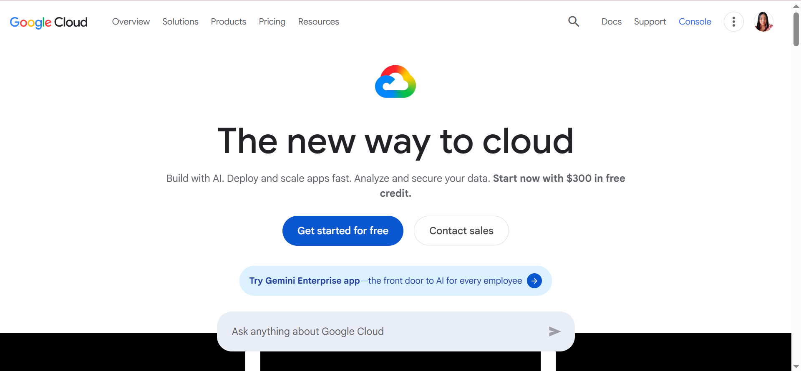

# Google Cloud Platform (GCP) Research Report

## Brief Overview
Google Cloud Platform (GCP) is a suite of cloud computing services that runs on the same infrastructure that Google uses internally for its end-user products, such as Google Search, Gmail, and YouTube. It focuses heavily on data analytics, machine learning, and cloud-native container orchestration.

## Global Infrastructure
GCP runs on Google’s private, high-performance global fiber-optic network rather than the public internet. This infrastructure connects secure data centers distributed across multiple regions and zones worldwide, ensuring ultra-low latency and high data throughput.

## Cloud Management Console
The **Google Cloud Console** provides a clean, web-based graphical interface for managing projects, configuring networking, viewing billing alerts, and deploying cloud-native applications through an intuitive central dashboard.

## Four (4) Core Services
1. **Google Compute Engine:** High-performance, customizable virtual machines running on Google's innovative infrastructure.
2. **Google Cloud Storage:** Secure, highly durable, and globally accessible object storage service.
3. **Google Kubernetes Engine (GKE):** Managed environment for deploying, managing, and scaling containerized applications using Kubernetes.
4. **BigQuery:** Fully managed, petabyte-scale, and cost-effective analytics data warehouse for business intelligence.

## Three (3) Advantages
* **Kubernetes Leadership:** Pioneer and creator of Kubernetes, offering industry-leading container management via GKE.
* **Advanced AI and Data Analytics:** State-of-the-art machine learning frameworks and big data tools powered by custom hardware like TPUs.
* **High-Speed Private Network:** Leverages Google's private global fiber network, minimizing public internet traffic routing issues.

## Typical Enterprise Use Cases
* Big data processing and real-time business analytics.
* Machine learning model training and artificial intelligence research.
* Containerized microservices architectures and cloud-native application deployment.

---
*Screenshot Evidence:*

